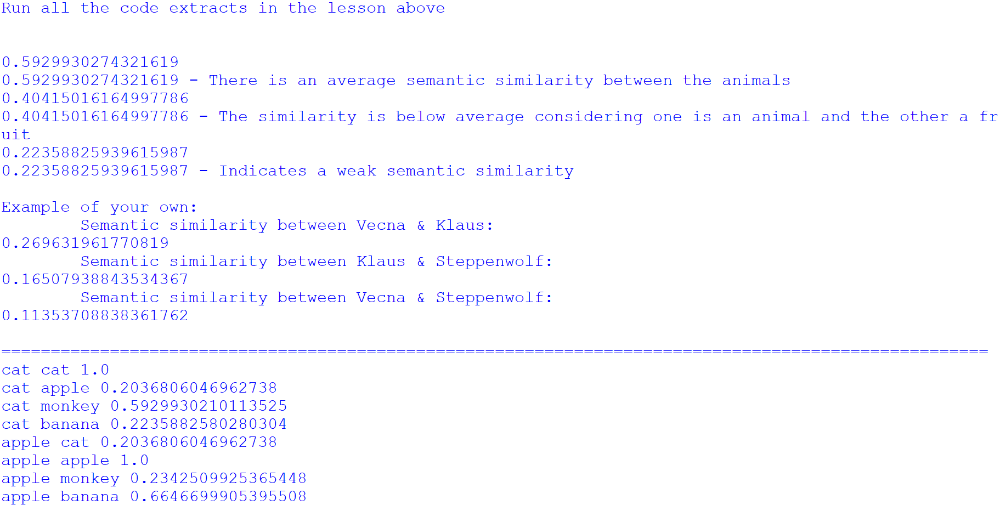
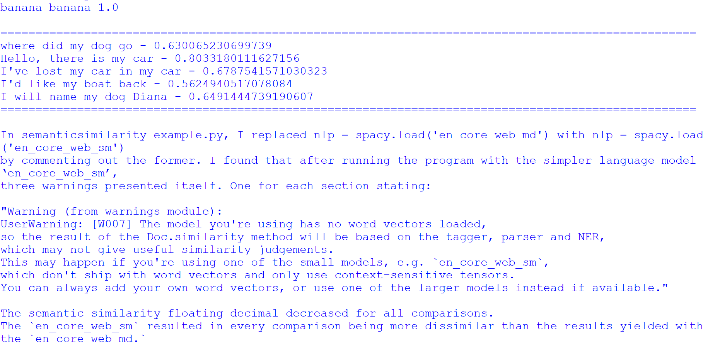

# Project name
Semantic similarity

# Project description
The project focuses on utilising spaCy for text similarity detection, primarily through the use of the 'similarity' keyword. It emphasises the significance of this task by highlighting the following key points:

*Importance of the project*

1. *Text Similarity Detection*: The project's primary objective is to demonstrate the importance of text similarity detection. This is crucial in various Natural Language Processing (NLP) applications where understanding the similarity between words or sentences is essential.

1. *Semantic Analysis*: The project underscores the value of semantic analysis in NLP. It allows for a deeper understanding of text meaning, which is vital in tasks such as information retrieval, document classification, and recommendation systems.

1. *Comparing Words and Sentences*: The project addresses both word-level and sentence-level similarity. This versatility is important as different NLP tasks may require comparisons at various levels of granularity.

1. *Practical Application*: By providing code examples and guidelines for working with text similarity using spaCy, the project aims to make this powerful NLP tool accessible and applicable in real-world scenarios.

*What the project does*

1. *Word Similarity*: The project demonstrates how to compare words in a text using spaCy. It explains that word similarity can be computed by iterating through tokens in a text and utilising the 'similarity' keyword.

1. *Vector Representations*: It introduces the concept of vector representations of words and sentences. These vector representations enable quantitative measures of similarity between words or sentences.

1. *Sentence-Level Similarity*: The project also delves into the importance of sentence-level similarity analysis. It outlines steps to compute the similarity between short texts or sentences.

1. *Practical Implementation*: The project provides practical steps to execute the code, encouraging users to create a file called 'semantic.py' and run code extracts. It further prompts users to experiment with their own examples.

1. *Model Comparison*: It highlights the significance of choosing an appropriate spaCy language model for the task. The project encourages users to compare the results obtained with 'en_core_web_sm' (a simpler model) to those from 'en_core_web_md' (a more complex model), showcasing the impact of model selection on similarity analysis.

In summary, the project is important because it demonstrates the practical application of spaCy in text similarity detection and underscores the significance of semantic analysis in various NLP tasks. It provides valuable insights into comparing words and sentences, along with guidance on model selection for optimal results.

# Installation section
*Tell other users how to install your project locally*

1. Install Python: 
    1. Download Python IDLE 3.6.8 to run the program
    1. Visit the official Python website at https://www.python.org/downloads/windows/ in your web browser.
    1. Click on the "Download Python 3.6.8" button
    1. Under Files section, download the one that matches your system architecture (32-bit or 64-bit). Most modern systems are 64-bit.
    1. Click on the installer to download it.
    1. Locate the downloaded installer file and double-click on it to run the Python installer.
    1. Check the box that says "Add Python 3.6.8 to PATH." 
    1. Click the "Install Now" button to start the installation process.
     
1. Open the Command Prompt (cmd)
    1. Clone repository: `git clone <repository-url>`
    1. Navigate to the project directory: `cd "path\to\semantic"`

1. Create a Virtual Environment:
    1. Create a folder for new virtual env: `mkdir Virtual_env`
    1. Navigate to folder: `cd Virtual_env`
    1. Create a virtual environment: `virtualenv semanticvenv`

1. Activate the Virtual Environment:
    + In Windows Command Prompt (Admin):
    1. In your Virtual_env folder there will be a folder called Scripts. Copy its path.
    1. Change directory to Scripts `cd "path\to\scripts\in\virtual\environment"`
    1. Activate virtual environment: `activate.bat`
    1. You will see (bookshelfvenv) at the start of cmd line
    1. change directory to app root directory: `cd "path\to\app"`

1. Verify Python installation: `python --version`
1. Verify pip installation: `pip --version`
1. Install the dependencies: `pip install -r requirements.txt`    

# Usage section
*Instruct others on how to use your project after they’ve installed it*

*Outline the steps necessary to build and run your application with venv and Docker:*
+ Activate virtual environment [see above]

+ Install Docker desktop @ https://www.docker.com/products/docker-desktop
+ Open Docker Desktop
+ login to Docker Hub @ https://hub.docker.com/

## Use the Command Prompt
1. Check that Docker desktop was successfully installed: `docker run hello-world`
1. Build the docker image: `docker build -t semantic ./` 
1. Run the docker image: `docker run -it semantic`
1. Deactivate the Virtual Environment: `deactivate`

## Use Docker Playground
1. Follow: https://labs.play-with-docker.com/
1. Start a new instance

In the terminal: 
1. Copy command from Docker Hub @ https://hub.docker.com/repository/docker/kcse1/semantic/tags?page=1&ordering=last_updated: `docker pull kcse1/semantic:spacy`
1. Run the docker image: `docker run -it kcse1/semantic:spacy`
1. Close session on Docker Playground

## Use Python IDLE
Run the program (F5) and select an option from the menu

1. Deactivate virtual environment in cmd when you are done working: `deactivate`

*Include screenshots of your project in action*

# Credits
*highlights and links to the authors of your project if the project has been created by more than one person*

@KC-software-en

# Add a URL to your GitHub repository

https://github.com/KC-software-en/vigilant-octo-robot

